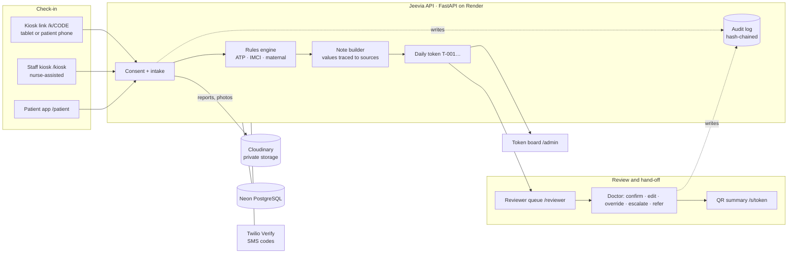

# Jeevia (जीविया)

**Human-in-the-loop, multimodal triage assistant for government and institutional health facilities in India.**

Jeevia turns what a patient says, the reports they carry and simple photos into a structured, prioritised
triage note, so a qualified clinician can review each patient in under four minutes.

> **Triage support only.** Jeevia does not diagnose, prescribe or replace a qualified professional. Urgency comes
> from fixed clinical rules, never from an AI model, and every health-related output is reviewed by licensed staff.

| | |
|---|---|
| **Web app** | https://jeevia-triage.vercel.app |
| **API (interactive docs)** | https://jeevia-api.onrender.com/docs |
| **Sample kiosk link** | https://jeevia-triage.vercel.app/k/MANIKPUR |
| **Live system status** | https://jeevia-triage.vercel.app/#status |
| **Role-by-role guide** | [docs/WORKFLOW.md](docs/WORKFLOW.md) |
| **Architecture and code map** | [docs/ARCHITECTURE.md](docs/ARCHITECTURE.md) |
| **Operations runbook** | [docs/OPERATIONS.md](docs/OPERATIONS.md) |

---

## Contents

1. [What Jeevia does](#1-what-jeevia-does)
2. [Safety rules the system enforces](#2-safety-rules-the-system-enforces)
3. [Who uses it, and where](#3-who-uses-it-and-where)
4. [How the system works](#4-how-the-system-works)
5. [Technology — what is used for what](#5-technology--what-is-used-for-what)
6. [Features](#6-features)
7. [Repository layout](#7-repository-layout)
8. [Run it locally](#8-run-it-locally)
9. [Configuration](#9-configuration)
10. [Testing](#10-testing)
11. [Deployment and operations](#11-deployment-and-operations)
12. [Sample accounts](#12-sample-accounts)
13. [Limits and next steps](#13-limits-and-next-steps)

---

## 1. What Jeevia does

Busy Indian health facilities — primary health centres, district hospitals, health camps, industrial and campus
clinics — see far more patients than doctors can talk to at length, in many languages, often with paper reports.
Jeevia helps in three moments:

1. **Check-in.** A patient (or a family member) checks in on a waiting-room tablet, on their own phone by scanning a
   QR poster, or with a nurse. They speak or tap their symptoms in their own language, hear them read back, answer a
   few simple questions, photograph their reports, and get a **token** (T-001, T-002 …).
2. **Prioritisation.** A deterministic rules engine (AIIMS Triage Protocol, IMCI for under-fives, maternal red flags)
   sets the urgency — *Critical*, *Semi-urgent* or *Routine* — and builds a structured note where every value sits
   next to the report crop or transcript it came from.
3. **Review and hand-off.** Doctors work a queue ordered by urgency, confirm or edit notes, override urgency only with
   a written reason, escalate, and refer — with a **QR summary** the receiving hospital can scan to see the patient's
   details and uploaded documents.

Everything anyone views or changes is written to a tamper-evident audit log.

## 2. Safety rules the system enforces

| Rule | How it is enforced |
|---|---|
| Non-diagnostic | Notes only restate patient-provided information; a disclaimer is on every screen, export and share page. |
| Urgency only from fixed rules | `backend/app/triage/rules/*.yaml`, evaluated by `rules.py`. The note pipeline cannot set or lower urgency. |
| Human in the loop | Only doctors confirm, override (≥ 15-character written reason; the original rules result is kept) and refer. Escalations must be acknowledged. |
| Patients never see triage status | The API strips urgency and notes from every response to patient and kiosk sessions. |
| Least privilege | Front-desk staff see names, tokens and status only; employers see fitness status only; kiosk links can only submit check-ins. Patient documents and photos open only for the doctors and nurses treating that visit (or via a QR summary with its code). |
| Two-factor staff sign-in | Doctors, nurses, receptionists, supervisors and employers need a phone OTP **and** their personal 4–6 digit PIN; weak PINs refused, lock after 5 wrong tries, OTP rate limits per phone and per address. |
| Consent first | An intake cannot be submitted without a consent record (self or proxy, with privacy context). |
| Tamper-evident audit | Every view, edit, override, export and share opening is hash-chained; the database rejects updates and deletes on the audit table. |
| Minimal retention | Voice recordings 24 h, photos 3 days, reports 30 days; files are private and served only through the API. |

## 3. Who uses it, and where

| Role | Main screen | Does | Never sees |
|---|---|---|---|
| **Supervisor** | `/admin` | Joins a facility from the all-India directory (or adds a missing public one), sets specialists on duty, creates kiosk links and QR posters, manages staff (role, deactivate, reset PIN), audits activity, can restart the server | Symptoms, notes, documents |
| **Receptionist** | `/admin` | Watches today's tokens, calls patients, corrects registration details, manages kiosk links and staff devices | Symptoms, notes, documents |
| **Nurse / ANM** | `/reviewer` (nurse view), `/kiosk` | Assisted intake with vitals, "do now" checklist, follow-up questions, escalation | — (cannot override or refer) |
| **Doctor / Medical Officer** | `/reviewer` | Reviews the queue, confirms/edits notes, overrides with a reason, acknowledges escalations, refers, exports, shares QR summaries | — |
| **Patient** | `/patient` | Adds a problem before visiting, sees own visits and reminders | Urgency, notes, family members' records |
| **Employer / organisation** | `/employer` | Registers the organisation and its workplaces (company clinic, industrial unit, campus, health camp), keeps the worker roster, sees fitness outcomes | Any clinical record |
| **Kiosk link** (no login) | `/k/<code>` | Registers a patient, captures consent and symptoms, uploads reports, issues a token | Everything else |
| **Receiving clinician** (no login) | `/s/<token>` | Opens a referral summary by QR + 6-digit access code | Anything outside that one visit |

The full step-by-step journey for each role is in **[docs/WORKFLOW.md](docs/WORKFLOW.md)**.

## 4. How the system works



**One check-in, end to end**

1. A patient opens a kiosk link (no login). Their browser gets an intake-only session for that facility.
2. Consent → who (new, or returning with ID + phone) → visit type → symptoms by voice, pictures or text → since when /
   how bad → report photos → a few closed follow-up questions → submit.
3. The API checks consent, runs the rules engine, builds the note, stores photos privately in Cloudinary, assigns the
   next daily token and writes audit events.
4. The token appears on the patient's screen, in the doctor's queue and on the front-desk token board within seconds.
5. The doctor opens the case, reviews values beside their sources, decides, and (if needed) refers with a QR summary.
6. Unreviewed critical cases escalate automatically after 15 minutes (semi-urgent after 60).

If the network drops, the kiosk saves the intake on the device and sends it when the connection returns, keeping the
real capture time so waiting time is never understated.

## 5. Technology — what is used for what

| Layer | Technology | Used for |
|---|---|---|
| Web app | **Next.js 16**, React 19, TypeScript, Tailwind CSS v4 | Every screen: website, kiosk, dashboards, share pages. Installable PWA with a service worker for offline intake. |
| Web hosting | **Vercel** (project `jeevia-triage`) | Serves the web app; runs one server route (`/api/ops/restart`) that holds the Render key for supervisor restarts. |
| API | **FastAPI** (Python 3.12), SQLAlchemy 2, Pydantic 2 | Authentication, role checks, intake, rules, notes, queue, referrals, shares, files, audit, exports. |
| API hosting | **Render** (web service `jeevia-api`, Singapore) | Runs the API; auto-deploys from `main`. |
| Database | **Neon** serverless PostgreSQL (project `jeevia`, `aws-ap-southeast-1`) | Relational records (users, facilities, patients, encounters, audit) with JSONB for intake and triage notes. A database trigger makes the audit table append-only. |
| SMS sign-in | **Twilio Verify** | Sends and checks one-time codes for phone login. |
| Document storage | **Cloudinary** (private, `jeevia/<facility>/<yyyy-mm>/<kind>/`) | Report scans, prescription photos, voice recordings. Uploaded as authenticated assets; served only through the API with signed downloads. |
| Rules | YAML rule files | AIIMS Triage Protocol, IMCI and maternal red flags; deterministic urgency. |
| Exports | fpdf2 and built-in writers | Triage note as PDF, print, JSON, CSV and FHIR R4. |
| Speech | Browser Web Speech API + speechSynthesis | Live transcription and read-back in the kiosk (server-side Indic ASR is a planned hand-off). |
| CI and uptime | **GitHub Actions** | `ci.yml` runs backend tests and frontend lint, type-check and build on every push; `keepalive.yml` pings the API every 10 minutes so the free Render instance stays awake. |

## 6. Features

**Check-in**
- Public kiosk links per facility with printable QR posters; open on any tab, tablet or phone; revocable instantly.
- Staff kiosk on bound tablets with patient search (household-phone disambiguation) and vitals entry.
- Voice-first intake with spoken read-back, icon mode, large text, 22 languages (full screens in English, Hindi, Odia).
- Maternal and chronic-disease branches; follow-up questions generated from what is still missing.
- Photo capture with in-browser compression; offline queue with automatic sync. Kiosk links keep working offline after one online visit (page, facility and session cached on the device).
- At organisation workplaces the kiosk asks for the employee / student ID and links the visit to the roster.
- Daily running tokens per facility.

**Clinical review**
- Queue ordered by urgency then waiting time, with auto-escalation timers.
- Case view: summary, flags (not confidence scores), rules trace, source disagreements, vitals and report values with image crops, trends against earlier visits, timeline, missing information, follow-up questions.
- Doctor and nurse views of the same note.
- Confirm, edit, override with reason, escalate and acknowledge, refer (destination suggested from on-duty specialists).
- Export as PDF, print, JSON, CSV or FHIR R4.
- Record occupational fitness (fit / restrictions / temporarily unfit) for rostered workers; correct patient details.
- **QR summary**: time-limited link + 6-digit code showing patient details, the reviewed note, the referral and uploaded documents; locks after 8 wrong codes; revocable; every opening audited.

**Administration**
- **All-India facility directory** (sub-centres to medical colleges, government and private, from OpenStreetMap) searchable by name, district or PIN code at sign-up; supervisors can add a missing public facility.
- **Organisation-first onboarding** for company clinics, industrial units, campuses and health camps: they appear in the directory only after the employer registers the organisation.
- Employer portal: fitness overview by department, worker roster with CSV import, workplaces, organisation profile.
- Facility setup covers type, services, specialists on duty, referral hospital and kiosk languages.
- Token board (with patient correction), kiosk links, staff management (role, deactivate, reset PIN), staff devices, audit log with chain verification and CSV export, data-retention view.

**Platform**
- Phone OTP sign-in; staff and employers add a personal PIN (two factors), change it from the dashboard; rotating refresh tokens, sign-out revocation, OTP rate limits.
- Alembic migrations run automatically at start-up; hourly retention purge inside the API.
- Live system status on the website (API, database, SMS, storage) with **Wake server** and supervisor-only **Restart server**.
- JSON logs with request ids and no request bodies; Prometheus-format `/metrics`.

## 7. Repository layout

```
Jeevia/
├── frontend/                 Next.js app (all user interfaces)
│   ├── src/app/              Routes: /, /auth, /k/[code], /kiosk, /reviewer/*, /admin/*, /patient/*, /employer/*, /s/[token], /api/ops/restart
│   ├── src/components/       UI kit, site chrome, intake flow, triage note views, share QR, status panel
│   ├── src/lib/              API contract + live/mock adapters, i18n, offline outbox, speech, status, exports
│   └── public/sw.js          Service worker (offline kiosk)
├── backend/                  FastAPI service
│   ├── app/routers/          auth, facilities, patients, encounters, kiosk, shares, files, admin
│   ├── app/triage/           rules engine + YAML rules, note pipeline, synthetic report renderer
│   ├── app/*.py              models, schemas, services, security, audit, storage, otp, exports, observability, seed
│   └── tests/                38 pytest tests
├── docs/                     WORKFLOW.md · ARCHITECTURE.md · OPERATIONS.md
├── prototype/                Original static HTML prototype (design reference)
├── docker-compose.yml        Postgres + API + web for local full-stack runs
├── render.yaml               Render service definition
└── .github/workflows/        ci.yml, keepalive.yml
```

## 8. Run it locally

**Fastest — frontend only, with a built-in sample backend**
```bash
cd frontend && npm install && npm run dev        # http://localhost:3000
```

**Full stack with Docker** (Postgres + API + web)
```bash
docker compose up --build                         # web :3000 · API :8000/docs · Postgres :5433
```

**API against your own Postgres**
```bash
cd backend
python3.12 -m venv .venv && .venv/bin/pip install -r requirements-dev.txt
cp .env.example .env        # set JEEVIA_DATABASE_URL, e.g. postgresql://jeevia:…@localhost:5432/jeevia
.venv/bin/python -m app.seed --reset              # schema + sample data
.venv/bin/uvicorn app.main:app --reload           # http://localhost:8000/docs

cd ../frontend
NEXT_PUBLIC_API_MODE=live NEXT_PUBLIC_API_URL=http://localhost:8000 npm run dev
```
Locally the OTP provider is `mock` (the code is shown on screen) and files go to `backend/data/uploads`.

## 9. Configuration

### API (`backend`, prefix `JEEVIA_`)

| Variable | Purpose | Production |
|---|---|---|
| `DATABASE_URL` | PostgreSQL connection string (`postgres://` and `postgresql://` both accepted) | Neon direct connection, `sslmode=require` |
| `JWT_SECRET` | Signs sessions (also used by the web app's restart route) | random, 48+ characters |
| `OTP_PROVIDER` | `mock` (local dev) or `twilio` | `twilio` |
| `TWILIO_ACCOUNT_SID`, `TWILIO_API_KEY_SID`, `TWILIO_API_KEY_SECRET`, `TWILIO_VERIFY_SERVICE_SID` | Twilio Verify | set |
| `DEMO_OTP`, `DEMO_PHONES` | Sample accounts that accept a fixed code | `123456`, six sample numbers |
| `STORAGE_BACKEND` | `local`, `cloudinary` or `s3` | `cloudinary` |
| `CLOUDINARY_CLOUD_NAME`, `CLOUDINARY_API_KEY`, `CLOUDINARY_API_SECRET` | Cloudinary | set |
| `S3_*` | Optional S3-compatible storage (e.g. Cloudflare R2) | unset |
| `RETENTION_HOURS_AUDIO` / `_IMAGE` / `_REPORT` | Automatic expiry of uploads | 24 / 72 / 720 |
| `ESCALATE_RED_MIN` / `ESCALATE_YELLOW_MIN` | Auto-escalation windows | 15 / 60 |
| `REQUIRE_BOUND_DEVICE` | Staff kiosk must be a bound device | `true` |
| `CORS_ORIGINS`, `WEB_BASE_URL` | Web app origin; used in kiosk and share links | `https://jeevia-triage.vercel.app` |
| `SEED_DEMO` | Seed sample data into an empty database | `true` |

### Web app (`frontend`)

| Variable | Purpose |
|---|---|
| `NEXT_PUBLIC_API_MODE` | `live` (production) or `mock` (built-in sample backend) |
| `NEXT_PUBLIC_API_URL` | API origin, e.g. `https://jeevia-api.onrender.com` |
| `NEXT_PUBLIC_HIDE_SAMPLES` | `1` hides the sample-accounts hint on the sign-in page |
| `RENDER_API_KEY`, `RENDER_SERVICE_ID`, `JEEVIA_JWT_SECRET` | Server-only; enable the supervisor **Restart server** button |

Secrets live only in the Render and Vercel dashboards — never in the repository.

## 10. Testing

```bash
cd backend && .venv/bin/pytest -q                  # 50 tests
cd frontend && npm run lint && npx tsc --noEmit && npm run build
```
Backend tests cover the rules engine, OTP (including lockout, rate limits and the Twilio path), the two-factor PIN
(setup, lockout, forgot, change, supervisor reset), document access, directory search, organisations, rosters and
fitness, staff management, token rotation
and revocation, bound-device intake, idempotent offline replay, consent enforcement, overrides, escalations, referrals,
exports, kiosk links and tokens, QR shares (codes, lockout, expiry, revocation), role isolation for every role,
patient isolation on shared household phones, audit logging and chain verification, the append-only guard, signed file
URLs, health reporting and concurrent audit writes. They run on SQLite and on PostgreSQL.

Browser end-to-end runs (Playwright) cover the full staff journey with OTP + PIN, organisation onboarding through to
the employer's fitness view, kiosk links on tablet and phone, a true-offline kiosk-link reload with queued intake and
sync, QR summaries with document viewing, and the status panel's wake flow — against local and production.

## 11. Deployment and operations

| Piece | Deploys how |
|---|---|
| API | Push to `main` → Render builds `backend/` and deploys automatically. |
| Web app | `vercel deploy --prod` from `frontend/` (project `jeevia-triage`). |
| Database | Neon project `jeevia`; the API applies Alembic migrations on start-up. |
| CI | GitHub Actions on every push, in both repositories. |

Day-to-day tasks — checking status, waking or restarting the server, rotating keys, backing up and restoring the
database, resetting sample data, Twilio trial limits — are in **[docs/OPERATIONS.md](docs/OPERATIONS.md)**.

## 12. Sample accounts

Three fictional patients, the sample organisation *Kalinga Steel Works* and these walkthrough accounts exist in
production (sign-in code `123456`, then staff PIN `4826`). Everything else is created by real use.

| Role | Phone | Opens |
|---|---|---|
| Doctor | 9000000001 | `/reviewer` |
| Nurse / ANM | 9000000002 | `/reviewer`, `/kiosk` |
| Receptionist | 9000000003 | `/admin` |
| Supervisor | 9000000004 | `/admin` |
| Employer | 9000000005 | `/employer` |
| Patient | 9876543210 | `/patient` |

Real staff register at `/auth` with their own phone and pick their workplace from the national directory; employers
register their organisation first so its clinics appear.

## 13. Limits and next steps

- **Twilio trial:** SMS codes reach only numbers verified in the Twilio console until the account is upgraded.
- **Render free instance:** may sleep when idle; the keep-alive workflow and the **Wake server** button cover this. A paid instance removes it.
- **Note pipeline:** summaries use a deterministic template; server-side Indic ASR (IndicConformer / Bhashini), translation (IndicTrans2), OCR (PaddleOCR) and a bounded summariser plug in behind `backend/app/triage/pipeline.py` without changing the note format.
- **Facility directory coverage:** OpenStreetMap is thorough for hospitals and PHCs but uneven for village sub-centres; supervisors can add missing public facilities. The official NHM/HFR registry can be loaded into the same table when access is available.

| Area | Owner |
|---|---|
| Frontend | Krutee |
| API, auth, storage | Saanvi |
| ML pipeline, identity resolution, retention job | Jyoti |

License: MIT
